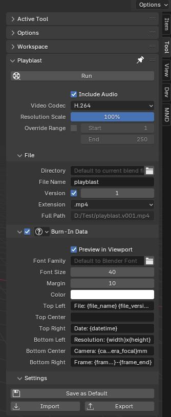

# 增强 Blender 拍屏预览插件

该插件增强 Blender 原生的拍屏，提供一些便利功能，可以一键拍屏预览动画，临时修改视频属性，还能方便的添加自定义信息到视频上

## 系统要求

- Blender 4.2.0 或更高版本
- FFmpeg（必需，用于视频处理）

由于 Blender Python API 的一些使用限制，使用此插件需要先在电脑上安装 FFmpeg，用于插件的视频处理合成

如果你使用的是 Windows 系统，推荐使用 [UniGetUI](https://github.com/marticliment/UniGetUI) 快速安装 FFmpeg

## 位置

3D Viewport ‣ N-panel ‣ Tool ‣ Anim Reviewer

## 使用教程

确保场景中有活动摄像机，进入拍屏面板点击“运行拍屏”即可

## 功能详解

### 基本拍屏

- 一键生成当前动画场景的预览视频
- 支持多种视频编码格式（H.264、H.265、MPEG-4、AV1）
- 可以同步输出音频
- 修改视频参数（分辨率，帧范围，输出位置等），不会影响场景里的设置，仅在拍屏中生效

### 字幕叠加 (Burn-in)

- 在视频上叠加自定义信息
- 支持 6 个位置：上左，上中，上右，下左，下中，下右
- 可显示场景信息、时间戳、帧数等元数据
- 支持自定义字体、颜色、大小和边距

### 设置管理

- 使用预设面板，轻松切换不同设置
- 导入/导出设置文件，方便团队分享设置

## 换行

如果你的叠加信息需要换行，可以使用 `\N` 表示换行符，虽然在 Viewport 上看不到效果（Blender 文字绘制不支持换行），但是在实际视频中能够换行。

## 贡献

如果有额外的视频格式或者视频元数据需求，或其他功能需求，欢迎提交 Issue 和 Pull Request！
